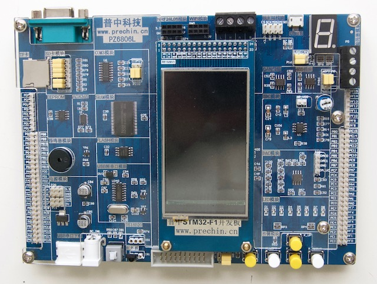

Chinese PZ6806L experimentation board with STM32F103ZE and lots of peripherals:

The µC is an ARM Cortex M3 @ 72 MHz with 64 KB RAM and 512 KB flash.

Serial USB, 1 MB SRAM, 2x µSD socket, RS232, A/D and D/A, 7-seg LED, CAN,
RS485, 4 buttons, 8 LEDs, trimpot, DS18B20, IR receiver, 240x400 LCD, JTAG,
buzzer, nRF24L01 + ESP8266 + ENC28J60 headers, SPI flash, I2C EEPROM & accel.

[Schematic](schematic.pdf) (most text is in Chinese but "guessable").

All pins seem to be allocated, but are brought out on headers, several jumpers.

- the 8 LEDs are connected in parallel with the 7-seg LED display

- KEY-UP is tied to PA0 with a pull-up, can also wake from sleep
    - all other keys are tied to ground, need an internal pull-up

- SPI1 is connected to the µSD socket on the LCD board

- SPI2 is connected to everything on the main board:
    - PB12  = ext ENC28J60 CS
    - PF8/9 = ext nRF24L01 CE/CSN
    - PG13  = 8 MB SPI flash CS
    - PG14  = µSD socket CS

- I2C1 is connected to a header labeled MT FW + MT FZ and has no pull-ups

- I2C2 is connected to all on-board I2C devices (EEPROM & ADX345)

- the on-board µSD socket can be connected via SPI or SDIO, not both (jumpers)

- either the RS232 usart3 can be connected or the 2nd I2C, not both (jumpers)

- either RS485 or ESP8266 can be connected to usart2, not both (jumpers)
